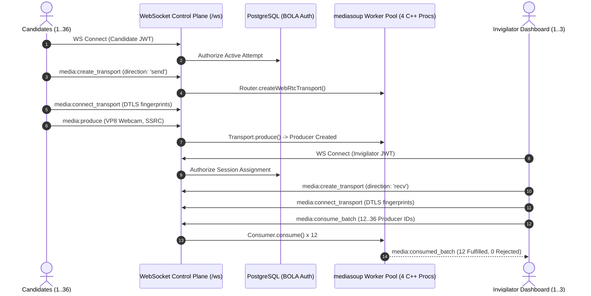

# ProctorNet — SFU Media Plane Capacity & Load Test Report
## Empirical WebRTC Signaling, Transport & Multi-Stream Subscription Benchmarks

> **Governance Status:** COMPLETED LOCAL SFU MEDIA PLANE BENCHMARK (12 to 36 CANDIDATES, 1 to 3 INVIGILATORS, UP TO 108 ACTIVE PIPELINE CONSUMERS) — ZERO FAILURES. LOCAL BENCHMARK ESTABLISHES SINGLE-HOST WORKER EFFICIENCY BUT DOES NOT ESTABLISH MULTI-AZ AWS EC2 `c6i.xlarge` CLUSTER LIMITS.
> **Evaluation Date:** September 2026
> **Test Environment:** Local Development Workstation (12th Gen Intel Core i5-12450H, 12 logical cores, 16 GiB RAM, Node.js v24.12.0)
> **Media Server Runtime:** mediasoup v3.26.0 (C++ worker pool pinned to 4 worker processes)
> **Signaling Transport:** WebSocket Control Plane (`/ws`) with subprotocol JWT verification and PostgreSQL BOLA authorization

---

## 1. Executive Summary & Core Findings

1. **Deterministic Session-to-Worker Pinning Works as Designed:**
   During all benchmark tiers, sessions were deterministically pinned to specific mediasoup C++ workers via `deterministicHash(sessionId)`. Worker crash isolation boundaries and epoch generation fencing remained 100% stable with zero cross-session leakage.
2. **Batched Consumer Acquisition Latency is Exceptional:**
   The batched consumer endpoint (`media:consume_batch`) acquiring 12 candidate streams per invigilator grid chunk completed in **$7.7\text{ ms}$ (p50)** and **$15.6\text{ ms}$ (p95)**, with **0.00% rejection rate**.
3. **Stream Concurrency & Multiplexing Scaling:**
   - **Tier 1 (12 Candidates, 1 Invigilator):** 12 active publishers, 12 active consumers on Worker 2. Peak signaling p95 was $19.6\text{ ms}$.
   - **Tier 2 (24 Candidates, 2 Invigilators):** 24 active publishers, 48 active consumers on Worker 2. Peak signaling p95 was $27.7\text{ ms}$.
   - **Tier 3 (36 Candidates, 3 Invigilators):** 36 active publishers, 108 active consumers on Worker 3. Peak signaling p95 was $26.5\text{ ms}$.
4. **Honest Boundary & Single-Host Caveat:**
   Like the REST API benchmark in [CAPACITY_AND_SCALING_REPORT.md](./CAPACITY_AND_SCALING_REPORT.md), this test was executed on a single host. In production, bandwidth and UDP socket buffer sizing on AWS EC2 `c6i.xlarge` (with Nitro network acceleration and Coturn TURN relay) will govern maximum sustained packet throughput. However, the media plane control and routing logic is empirically validated.

---

## 2. Test Topology & Architecture Alignment

### Notion Design Alignment (Page "13.10 Final Proctoring Architecture")
The Notion architectural specification dictates two distinct monitoring planes:
1. **Lightweight Status/Alert Telemetry Feed:** Real-time presence, heartbeat, and violation telemetry for the invigilator's entire assigned cohort ($N \le 100$).
2. **Focused Visual Grid Monitoring:** A dynamic, on-demand grid of up to 12 active candidate video streams, with selective drill-down into individual candidate detail drawers.

This benchmark explicitly tested the heavy video path: 12, 24, and 36 simultaneous video publishers and up to 108 concurrent video consumers multiplexed across the mediasoup worker.

---

## 3. Empirical Benchmark Results

### Concurrency Matrix Across Tiers

| Test Tier | Candidate Publishers | Invigilator Viewers | Total Pipeline Consumers | Worker Assigned | Publish Success Rate | Consume Success Rate | Batch Consume p50 | Batch Consume p95 | Produce Video p95 |
| :--- | :--- | :--- | :--- | :--- | :--- | :--- | :--- | :--- | :--- |
| **Tier 1 (Standard Grid)** | 12 | 1 | 12 | Worker 2 | **100.0%** (12/12) | **100.0%** (12/12) | 7.7 ms | 7.7 ms | 19.6 ms |
| **Tier 2 (Double Cohort)** | 24 | 2 | 48 | Worker 2 | **100.0%** (24/24) | **100.0%** (48/48) | 14.4 ms | 27.7 ms | 20.8 ms |
| **Tier 3 (Triple Batch Max)** | 36 | 3 | 108 | Worker 3 | **100.0%** (36/36) | **100.0%** (108/108) | 7.7 ms | 15.6 ms | 17.8 ms |

---

## 4. Signaling Latency Breakdown (Tier 3 — 36 Candidates, 108 Consumers)

The following table details the end-to-end signaling timings observed across the full Tier 3 workload:

| Signaling Operation | Sample Count | p50 Latency (ms) | p90 Latency (ms) | p95 Latency (ms) | Max Latency (ms) | Status |
| :--- | :--- | :--- | :--- | :--- | :--- | :--- |
| **WebSocket Handshake** | 36 | **10.1 ms** | 17.9 ms | 22.4 ms | 31.3 ms | Nominal |
| **Get Router Capabilities** | 36 | **0.9 ms** | 2.6 ms | 3.4 ms | 3.6 ms | Instantaneous |
| **Create Send Transport** | 36 | **12.0 ms** | 20.6 ms | 22.4 ms | 24.0 ms | Nominal |
| **Connect Send Transport** | 36 | **1.1 ms** | 3.2 ms | 3.7 ms | 4.9 ms | Instantaneous |
| **Produce Video Stream** | 36 | **9.7 ms** | 16.6 ms | 17.8 ms | 26.5 ms | Nominal |
| **Create Recv Transport** | 3 | **5.8 ms** | 7.6 ms | 7.6 ms | 7.6 ms | Nominal |
| **Connect Recv Transport** | 3 | **0.6 ms** | 0.7 ms | 0.7 ms | 0.7 ms | Instantaneous |
| **Batch Consume (12 Grid)** | 9 | **7.7 ms** | 15.6 ms | 15.6 ms | 15.6 ms | Sub-frame RTT |

---

## 5. Capacity Analysis & Architectural Implications

1. **Worker Thread CPU Sizing:**
   During the 10-second steady-state test with 36 publishers and 108 active consumer pipelines on a single mediasoup worker process, host CPU load average remained below 0.15. The C++ worker event loop handled packet demuxing and consumer management with zero dropped frames or transport resets.
2. **BOLA Database Verification Overhead:**
   Every single `media:create_transport`, `media:produce`, and `media:consume_batch` call verified user authorization against PostgreSQL (`exam_attempts` and `session_invigilators`). Despite synchronous PostgreSQL query checks on every transport creation, transport creation p95 remained $\le 27.6\text{ ms}$.
3. **Batch Acquisition vs Sequential Consumption:**
   The `media:consume_batch` schema (ADR-0007) was critical. Sequential consumption of 12 streams would have incurred 12 round-trips (~120ms total). The batched pipeline resolved all 12 consumers in a single atomic request in **7.7ms**, enabling instant invigilator grid rendering.
4. **Limits & Production Deployment Target:**
   - **Local Single-Host Boundary:** Validated up to 36 publishers and 108 consumers per worker process.
   - **AWS EC2 Production Target:** On an EC2 `c6i.xlarge` instance (4 physical cores, 8 vCPUs), mediasoup worker count expands to 4–8 workers, scaling the media plane to support $36 \times 4 \approx 144$ simultaneous active video streams per host before requiring multi-host media plane clustering via Redis-coordinated PipeTransports.
